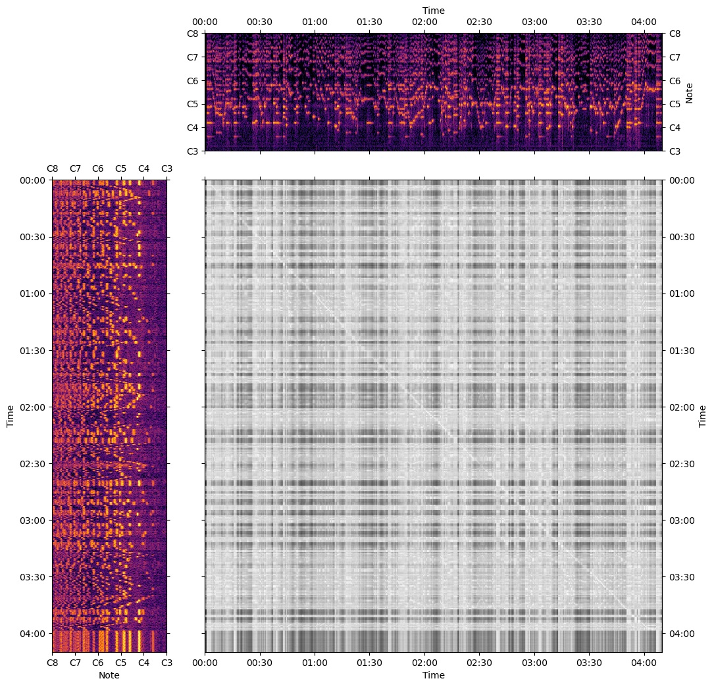
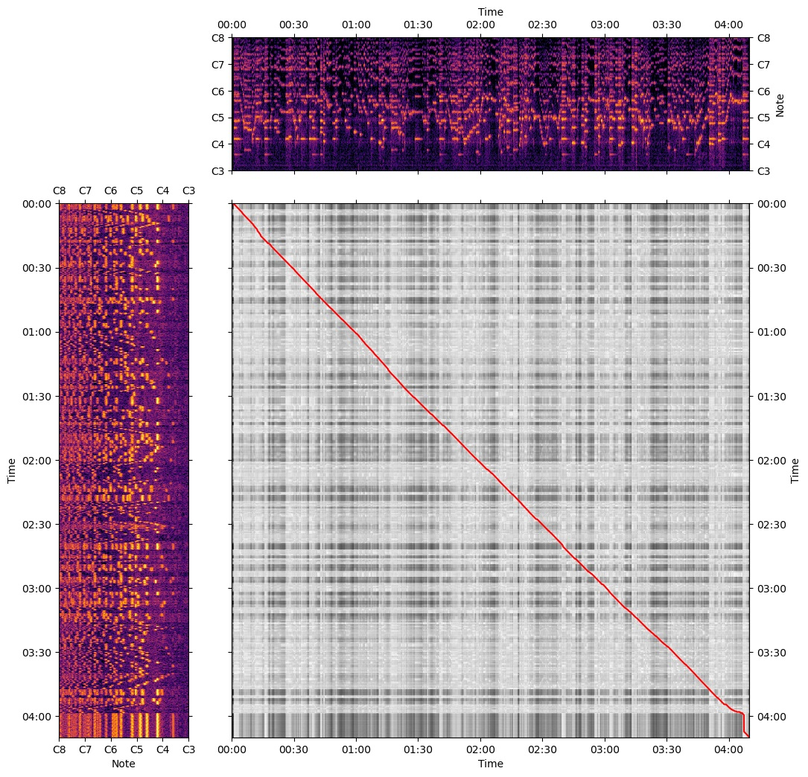

# Alignment Process

> The source code for creating this dataset can be found in this GitHub [repository](https://github.com/salu133445/bach-violin-dataset).

Below we describe how we derive the alignment between a musical score and a recording. We will use the following score and recording as an example.




Here is the alignment result of this example, where white dots and green lines show the estimated note onsets and durations.


---

## Step 1 -- Process the score

We first transform the musical score into a note sequence, stored as a CSV file as follows.

```text
onset,offset,pitch,velocity
0,24,55,64
0,24,62,64
0,24,70,64
0,27,79,64
27,30,77,64
30,33,75,64
33,36,74,64
36,39,72,64
39,42,70,64
...
```

---

## Step 2 -- Synthesize the score

We then synthesize the score using [FluidSynth](https://www.fluidsynth.org/), an open-source software synthesizer, with the [MuseScore General SoundFont](https://musescore.org/en/handbook/3/soundfonts-and-sfz-files).

---

## Step 3 -- Align the score to the recording

Finally, we perform dynamic time warping (DTW) on the constant-Q spectrogram of the synthesized audio and that of the recording.

Here is the resulting cost matrix we get from DTW. At the top is the recording, and at the left is the synthesized audio



And here is the optimal warping path.



This optimal warping path encodes the alignment between the scores and the recordings. We can then use this alignment to obtain the start and end time of each note as follows.

```text
start,end
0.96,3.68
0.96,3.68
0.96,3.68
0.96,4.032
4.064,4.384
4.416,4.768
4.8,4.992
4.992,5.312
5.344,5.568
...
```
