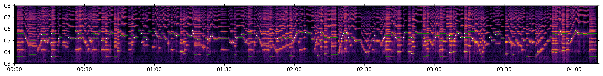

The Bach Violin Dataset is a collection of high-quality public recordings of Bach's sonatas and partitas for solo violin (BWV 1001–1006). The dataset consists of 6.5 hours of professional recordings from 17 violinists recorded in various recording setups. It also provides the reference scores and estimated alignments between the recordings and scores.

Below is an example of the alignment provided, where white dots and green lines show the estimated note onsets and durations.

{: style="max-height: 200px; width: 600px; max-width: 100%;"}



The dataset and the source code for the alignment process can be found [here](https://salu133445.github.io/bach-violin-dataset/).
